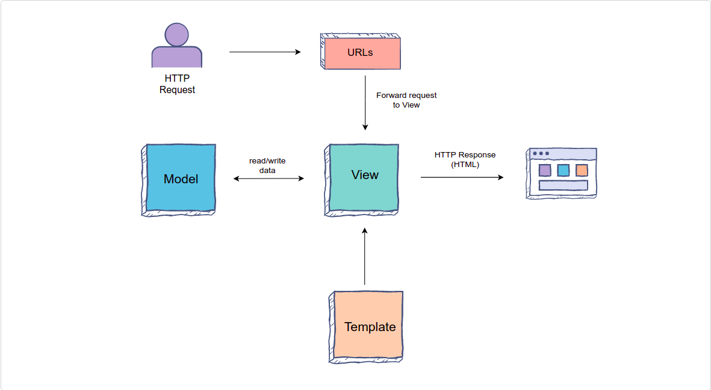

# Django Design Pattern

Django uses an MTV architecture

## Model Template View architecture

In a traditional data-driven website, the web app waits for HTTP requests from the **web browser (or another client)**

When a request is received, the application works out what is needed based on the URL and any possible information from a `POST` request and a `GET` request

Depending on what is required, the application may then read or write information from a database, or perform other tasks required to satisfy the request

The application will then return a response to the web browser to display by inserting the retrieved data into placeholders in an HTML template

Django web applications typically group the code that handles each of these steps into separate files



- **URLs:** While it is possible to process requests from every single URL via a single function, it is much more **maintainable** to write a separate **view function** to handle each resource. 
  - A **URL mapper** is used to redirect HTTP requests to the appropriate view based on the request URL.
    - The URL mapper can also match particular patterns of strings or digits that appear in a URL, and pass these to a view function as data.
- **View:** A view is a **request handler function**, which receives HTTP requests and returns HTTP responses. Views access the data needed to satisfy requests via models, and also delegate the formatting of the response to templates.
- **Models:** Models are Python objects that define the structure of an application’s data and provide mechanisms to manage (add, modify, delete) and query records in the database.
- **Templates:** A template is a text file defining the structure or layout of a file (such as an HTML page), with placeholders used to represent actual content. A view can dynamically create an HTML page using an HTML template, populating it with data from a model. A template can be used to define the structure of any type of file; it doesn’t have to be HTML

## Creating a Django Project

A Django project is a collection of applications and configurations that, when combined together, will make up the full web application, which is a complete website running with Django. 

The following command will create a Django project in the first_project directory:
`django-admin startproject first_project`

```
first_project
├── first_project
│   ├── asgi.py
│   ├── __init__.py
│   ├── settings.py
│   ├── urls.py
│   └── wsgi.py
└── manage.py
```

These files are:

The outer `first_project/` root directory, which is a container for our project. Its name doesn’t matter to Django; we can name it anything we like.

`manage.py:` A command-line utility that lets us interact with our Django project in various ways.

The inner `first_project/` directory is the actual Python package for our project.

`first_project/__init__.py:` This is a blank Python script that, due to its special name, lets Python know that this directory can be treated as a package.

`first_project/settings.py:` This is a Python script where we will store all of our project settings.

`first_project/urls.py:` This is a Python script that will store all the URL patterns for our project. Basically, it is where we will store the different pages of our web application.

`first_project/views.py:` This is a Python script that will handle all of the requests and send an HttpResponse object in return.

`first_project/asgi.py:` An entry-point for ASGI-compatible web servers to serve our project.

`first_project/wsgi.py:` This is a Python script that acts as the Web Server Gateway Interface. It helps us in deploying our web application to production.

`db.sqlite3:` This is a database file where all of the generated data will be stored.

### Running the project

The following command is used to run the Django project: `python manage.py runserver`

### What is a Django Application?

Before we created a Django project and now we'll create a **Django application**. In Django terms, the project and application are **very different**.
A project is comprised of multiple different applications.

A Django application is **created to perform a particular function** for a Django project. 
For example, a project could have a registration application, a comments application, a polling application, etc...

The following command will create a Django application in the `first_project` directory: `python manage.py startapp first_app`

In this example, `startapp` is the keyword to create the application and first_app is the name of the application that we are creating

```
first_app
├── admin.py
├── apps.py
├── __init__.py
├── migrations
│   └── __init__.py
├── models.py
├── tests.py
└── views.py
```

These files are:

`migrations/:` This directory stores database specific information as it relates to the models.

`__init__.py:` This is a blank Python script that, due to its special name, lets Python know that this directory can be treated as a package.

`admin.py:` This is a Python script where we can register our model classes. We will discuss it further in later chapters.

`apps.py:` This is a Python script where we can place application-specific configurations.

`models.py:` This is where we store the application’s data models. We specify the entities and relationships between the data.

`tests.py:` Here we store the test functions to test our code.

`views.py:` This is where we have functions that handle requests and return responses.

Before we run our first_app application that will show us "Hello World!", we need to perform the following steps:

#### Step 1: Add the `first_app` application

We need to tell Django that we created this application.
In order to do this, we need to go to the `settings.py` file of our project and add the application to the list of installed applications.
Open the `settings.py` file, scroll down, and we will see a bunch of variables.
The one that we are looking for is called `INSTALLED_APPS`. 
This variable contains the list of applications that Django adds by default, including authorization, administration, messages apps, etc.
Let’s add in our `first_app` application as a string and save the file.

#### Step 2: Add a `Hello World` view

We need to create a view in our application which shows Hello World! For that we open first_app/views.py file.

First we have to import an HttpResponse object from the django.http module. For this, add the following line: `from django.http import HttpResponse`

Then, we create a **view function** called `index`. Each view takes at least one argument—conventionally, we call it a request, but we can call it whatever we want. 
Each view **must** return an HttpResponse object. This response object takes a string parameter representing the content of the page. 
Since we just want to return Hello World!, we add the following line

```python
def index(request):
  return HttpResponse("Hello World!")
```

**NOTE:** Each view of this application is going to exist within the views.py file as its own individual function.

```python
from django.shortcuts import render
from django.http import HttpResponse

# Create your views here.

def index(request):
  return HttpResponse("Hello World!")
```

**NOTE:** This `HttpResponse` can also take a string of HTML. So, we can return something like `<h1>Welcome to Educative<h1>`, too

#### Step 3: Map a view to a URL

In order to **see** this view, we have to map it to a URL. Open the `first_project/urls.py` file. We will see a list of function calls to URLs.

First, we have to import `views` from `first_app`: `from first_app import views`

Then, we add the following URL in urlpatterns list: `path('',views.index, name='index'),`

As we can see, the **first parameter** is the **path of the URL**. 
The **second parameter** is the **name of a function to which we have mapped this URL**
The **third parameter** is the **name of this specific URL**.

```python
from django.contrib import admin
from django.urls import path
from first_app import views

urlpatterns = [
  path('',views.index,name="index"),
  path('admin/', admin.site.urls),
]
```

Execute the example -> Now that everything is set, we just need to use the following command to run the server: `python manage.py runserver`

Based on how we set it up, the homepage will show a basic text that says "Hello World!"

## Static and Dynamic Routing

Routing can be of two types, **static** or **dynamic**. To understand static routing, we can consider a specific URL that leads to a specific page. For example, `/home` take us to the home page of a website and `/about` takes us to the about page. However, these are not the only kinds of URLs.

In social media sites, we can have URLs such as `/profile/101011` and `/profile/102045`. These URLs lead us to the same page, but depending on the variable part of the URL, the content shown can be different. This is called **dynamic routing**.

### Static Routing

In static routing, we specify a constant URL string as a path in the `urls.py` file.

For example, in the mini-application given below, we have specified two static routes with the URLs `home/` and `educative/` respectively

**NOTE:** The path is a case-sensitive string. Therefore, `/educative` and `/Educative` are two different URLs

```python
from django.contrib import admin
from django.urls import path
from first_app import views

urlpatterns = [
  path('',views.index,name="index"),
  path('home/',views.home,name="home"),
  path('educative/',views.educative,name="educative"),
  path('admin/', admin.site.urls),
]
```

### Dynamic Routing

In dynamic routing, we don’t specify a *constant* URL path. Instead, we pass a URL with **variable** parameters in it. The parameters may already be present in the URL itself, or they may be the result of user input.

To add a variable in a path, we use it between the angle brackets. For example, `<question_id>`, where **question_id** is the name of the variable we pass to the path as the first parameter.

In the example below, we are using a variable path, `<age>`, where age is a variable, and its value will be equal to whatever the user appends to the URL. **This value is then passed to the view function as a parameter.**

```python
from django.contrib import admin
from django.urls import path
from first_app import views

urlpatterns = [
  path('',views.index,name = "index"),
  path('<age>/',views.show_age,name = "show_age"),
  path('admin/', admin.site.urls),
]
```

We passed a variable by the name of `age` in angle brackets

```python
from django.shortcuts import render
from django.http import HttpResponse

# Create your views here.

def index(request):
  return HttpResponse("Hello World!")

def show_age(request, age):
  return HttpResponse("I am %s years old." % age)
```

We made a function by the name of `show_age`, and we also passed a parameter age along with the request

Then we return an `HttpResponse`, which takes a string where `%s` indicates a string variable value replacement

We also need **path converters** with dynamic URL routes in our application

We used the path `<age>`, where `age` was a variable. Then, the value that we appended in the URL at the place of `age`, that value was passed as a string type parameter to the view function `age()`. 

This is the default behavior that the string data type parameters will have. However, we can use a **converter** to convert this value into another datatype before passing it to the view function. 

A general use-case for this conversion could be that: we want to take the age of the user and apply computations to it to find out if they are eligible for an offer. Therefore, it is appropriate that the `age` is an integer type variable.

#### Path Converters

The following are the path converters available for us to use.

- `str`: Matches any non-empty string, excluding the path separator, `'/'`.

- `int`: Matches zero or any positive integer.

- `slug`: Matches any slug string consisting of ASCII letters or numbers, plus the hyphen and underscore characters. For example, building-your-1st-django-site.

- `uuid`: Matches a formatted UUID.

- `path`: Matches any non-empty string, including the path separator, '/'. This allows us to match against a complete URL path rather than a segment of a URL path, as with str.


```python
from django.contrib import admin
from django.urls import path
from first_app import views

urlpatterns = [
  path('',views.index,name = "index"),
  path('<int:num>/',views.even_or_odd,name = "even_or_odd"),
  path('admin/', admin.site.urls),
]
```
We passed a variable by the name of `num` in angle brackets, also combined with an int path converter, which will convert the string into an integer.

```python
from django.shortcuts import render
from django.http import HttpResponse

# Create your views here.

def index(request):
  return HttpResponse("Hello World!")

def even_or_odd(request, num):
  if(num%2==0):
    output="%s is an even number." % num
  else:
    output="%s is an odd number." % num
  return HttpResponse(output)
```
- First, we made a function by the name of `even_or_odd`, and we also passed a parameter num along with the request.

- Then, we are checking if the number we passed in the URL is even or not, and then updating the output accordingly.

- Finally, we are returning an HttpResponse, which takes output as a parameter.

## URL Mapping

We showed a direct mapping that imported the `views.py` file into the urls.py file of our projects. So, we were connecting views of our application to the urls.py file of the project itself. However, this solution is not modular. Let’s examine why.

Consider that we have a large scale project that might include various applications. Moreover, the project will also likely have several URL paths, where most paths will be application-specific. So, for a modular solution, we would prefer that the paths specific to an application be declared inside the application folder. This is where the include function will come in and help us out.
